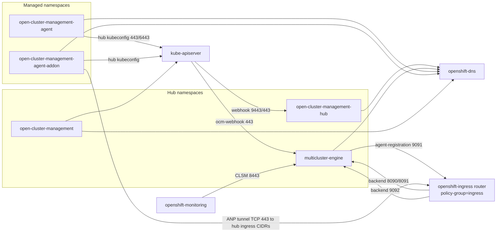

# Server Foundation Network Communication Inventory

> **Generated**: 2026-07-17  
> **Purpose**: Allow-list of SF workloads, ports, and ingress/egress paths for NetworkPolicy implementation.  
> **This document does not ship NetworkPolicies** — it is the inventory those policies implement against.

## Sample environment

| Role | Context / evidence |
|------|--------------------|
| Hub | Sample MCE/ACM hub (~2.17) |
| Spoke | Sample managed cluster |
| Charts | `stolostron/backplane-operator` toggle charts (shallow clone 2026-07-17) |
| Code | - Local `ocm`, `managedcluster-import-controller` - cloned MSA, MOF, cluster-proxy, cluster-permission, MRA, CLSM |

Toggles observed on sample hub: server-foundation, cluster-lifecycle, cluster-proxy-addon, cluster-permission, managed-serviceaccount (addon-manager lifecycle), cluster-manager. **Not deployed on sample hub**: `multicluster-role-assignment`, hub `work-controller` (feature-gated off), dedicated MSA hub manager Deployment, gRPC server.

---

## 1. Coverage matrix

| Scope | Namespaces | Workloads (selectors) | Services / Routes | Listening ports |
|-------|------------|----------------------|-------------------|-----------------|
| OCM ClusterManager / Klusterlet | **Hub** - `open-cluster-management-hub` - `multicluster-engine` (`cluster-manager` operator)  **Managed** - `open-cluster-management-agent` | **Hub** - `app=clustermanager-registration-controller` - `app=cluster-manager-registration-webhook` - `app=cluster-manager-work-webhook` - `app=clustermanager-placement-controller` - `app=clustermanager-addon-manager-controller` - `app=cluster-manager-addon-webhook` - `app=cluster-manager`  **Optional** - `app=cluster-manager-work-controller` - `app=cluster-manager-grpc-server`  **Managed** - `app=klusterlet` - `app=klusterlet-agent` - optional split registration/work agents | - Webhook Svcs `cluster-manager-{registration,work,addon}-webhook` (:9443) - placement debug Svc `:9443` - optional gRPC Svc `:8090` / `:443` | - Webhooks **9443** - health **8000** - metrics **8080** - controllers healthz **8443** - placement debug **9443** - gRPC **8090** - operators healthz **8443** |
| server-foundation chart | **Hub** - `multicluster-engine`  **Managed** - `open-cluster-management-agent-addon` (foundation agent) - `open-cluster-management-agent` (tls-profile-sync sidecar) | - `app=managedcluster-import-controller-v2` - `control-plane=ocm-controller` - `control-plane=ocm-proxyserver` - `control-plane=ocm-webhook` - managed `component=work-manager` (`klusterlet-addon-workmgr`) - sidecar `tls-profile-sync` on klusterlet | - `agent-registration` (:9091) + Route - `ocm-webhook` (443→8000) - `ocm-proxyserver` (443→6443) | - MIC **9091** (agent-reg) - MIC metrics **8383** (code) - ocm-webhook **8000** - ocm-proxyserver secure **6443**, proxy-service **9092** - ocm-controller health **8000** - foundation agent `--port=4443` / `--agent-port=443` |
| clusterlifecycle-state-metrics | **Hub** - `multicluster-engine` | - `app=clusterlifecycle-state-metrics-v2` | - Svc `clusterlifecycle-state-metrics-v2` (:8443) - ServiceMonitor same name | - HTTPS metrics **8443** - HTTP **8080** - health **8081** |
| cluster-proxy (+ ANP) | **Hub** - `multicluster-engine`  **Managed** - `open-cluster-management-agent-addon` | **Hub** - `proxy.open-cluster-management.io/component-name=proxy-server` (`cluster-proxy`) - `component=cluster-proxy-addon-manager` - `component=cluster-proxy-addon-user`  **Managed** - `proxy.open-cluster-management.io/component-name=proxy-agent` | - `proxy-entrypoint` (**8090**, **8091**) - `cluster-proxy-addon-anp` (**8091**) + Route passthrough - `cluster-proxy-addon-user` (**9092**) + Route reencrypt | - ANP proxy-server **8090** - agent-server **8091** - user-server **9092** (also ANP client **8090**) - health **8000** (user/service-proxy) |
| managed-serviceaccount | **Hub** - no dedicated manager Deployment (AddonTemplate + addon-manager)  **Managed** - `open-cluster-management-agent-addon` | **Managed** - `addon-agent=managed-serviceaccount` | - None required for NP (egress-only typical) | - Agent health probe chart **8000** - code defaults metrics **:38080**, health **:38081** (verify live) |
| cluster-permission | **Hub** - `multicluster-engine` (MCE) - historically `open-cluster-management` | - `name=cluster-permission` | - None | - Metrics **8286** (code default; no Service on sample hub) |
| ACM SF controllers | **Hub** - `open-cluster-management` | - `app=klusterlet-addon-controller-v2` / `component=klusterlet-addon-controller` - MRA (when installed): chart Deployment in ACM namespace | - None on sample hub for KAC | - KAC: API/DNS egress only (no declared ports) - MRA: health **8081** - MRA metrics often disabled (`0`) or **:8443** if enabled |

---

## 2. Cross-cutting allow categories

Every SF NetworkPolicy namespace should start from **deny-all** then allow:

| Category | Direction | Peers | Ports | Rationale |
|----------|-----------|-------|-------|-----------|
| DNS | Egress | - `openshift-dns` (UDP/TCP **5353**) - non-OCP: `kube-system` / `k8s-app=kube-dns` **53** | - **5353** - **53** | Name resolution |
| Kubernetes / OpenShift API | Egress | - `kubernetes.default.svc` **443** - or host-network API **6443** | - **443** - **6443** | Controllers, agents, webhook clients |
| Admission webhooks | Ingress | - kube-apiserver → webhook Services | - See per-workload (**9443** or **443**) | Validating/Mutating/CRD conversion |
| Metrics scrape | Ingress | - `openshift-monitoring` - `openshift-user-workload-monitoring` (Prometheus) | - Component metrics ports | Observability |
| Same-namespace peers | Ingress/Egress | - Explicit podSelectors only | - As needed | Least privilege; avoid namespace-wide allow |
| Hub ↔ spoke (proxy tunnel) — hub ingress | Ingress to ANP/user backend pods | - OpenShift router `namespaceSelector` `network.openshift.io/policy-group=ingress` (`openshift-ingress`) - pods often also `ingresscontroller.operator.openshift.io/deployment-ingresscontroller=default` | - Backend **8090** / **8091** (ANP `proxy-entrypoint` / `cluster-proxy-addon-anp`) - Backend **9092** (`cluster-proxy-addon-user`) - not Route :443 | Router pods forward to in-cluster Services after the external Route hop |
| Hub ↔ spoke (proxy tunnel) — spoke egress | Egress from proxy-agent | - Hub ingress LoadBalancer / router **CIDRs** - (or other allow-listed egress to the hub Route host) - Route/IngressController objects are not NP peers | - External hop **TCP 443** to hub - hub backend remains **8091** (ANP) / **9092** (user) in-cluster | Konnectivity agent dials hub Route host:443; NP must allow that egress by CIDR (or equivalent), not by Route name |
| Hub ↔ spoke (kubeconfig) | Egress (spoke agents → hub API) | - Hub API / external endpoint in hub kubeconfig | - **443** - **6443** | Registration, work, addons |

---

## 3. Per-workload sheets

### 3.1 OCM ClusterManager / Klusterlet

#### Hub — `open-cluster-management-hub`

| Workload | Selector | Ingress | Egress |
|----------|----------|---------|--------|
| `cluster-manager-registration-controller` | `app=clustermanager-registration-controller` | - None (healthz local **8443**) | - API - DNS |
| `cluster-manager-registration-webhook` | `app=cluster-manager-registration-webhook` | - kube-apiserver → Svc `:9443` - paths `/validate-…`, `/mutate-…` (ManagedCluster / ManagedClusterSetBinding) | - API - DNS |
| `cluster-manager-work-webhook` | `app=cluster-manager-work-webhook` | - kube-apiserver → Svc `:9443` - path `/validate-work-…-manifestwork` | - API - DNS |
| `cluster-manager-placement-controller` | `app=clustermanager-placement-controller` | - Optional debug Svc `:9443` (`/debug/placements/`) when `PlacementDebugServer` enabled | - API - DNS |
| `cluster-manager-addon-manager-controller` | `app=clustermanager-addon-manager-controller` | - None (healthz **8443**) | - API - DNS |
| `cluster-manager-addon-webhook` | `app=cluster-manager-addon-webhook` | - kube-apiserver → Svc `:9443` (Addon CRD conversion) | - API - DNS |
| `cluster-manager-work-controller` (**optional**) | `app=cluster-manager-work-controller` | - None (healthz **8443**) | - API - DNS - only when `WorkControllerEnabled` |
| `cluster-manager-grpc-server` (**optional**) | `app=cluster-manager-grpc-server` | - Clients → Svc **8090** (or LB **443→8090**) | - API - DNS |

Webhook container also binds metrics **8080** and health **8000** (not always Service-exposed).

#### Hub — `multicluster-engine`

| Workload | Selector | Ingress | Egress |
|----------|----------|---------|--------|
| `cluster-manager` (registration-operator) | `app=cluster-manager` | - None | - API - DNS - may pull images / reconcile ClusterManager |

#### Managed — `open-cluster-management-agent`

| Workload | Selector | Ingress | Egress |
|----------|----------|---------|--------|
| `klusterlet` (operator) | `app=klusterlet` | - None | - Spoke API - DNS |
| `tls-profile-sync` (sidecar on klusterlet) | same pod | - None (metrics disabled) | - Spoke API - DNS |
| `klusterlet-agent` (singleton) **or** split `klusterlet-registration-agent` / `klusterlet-work-agent` | `app=klusterlet-agent` (etc.) | - None (healthz **8443**) | - **Hub API** (bootstrap + hub kubeconfig) - spoke API - DNS |

#### Hosted mode notes

When `ClusterManager` `deployOption.mode=Hosted`, webhook Services may use external endpoints; sample CR uses NodePorts **30443** (registration) / **31443** (work). Inventory NP rules must allow apiserver→those endpoints instead of in-cluster Services.

---

### 3.2 server-foundation chart

Chart: `backplane-operator/.../toggle/server-foundation`.

#### Hub — `multicluster-engine`

| Workload | Selector | Ingress | Egress |
|----------|----------|---------|--------|
| `managedcluster-import-controller-v2` | `app=managedcluster-import-controller-v2` | - **agent-registration** Svc/Route **9091** - metrics **8383** (if scraped) | - Hub API - DNS - may reach spoke APIs / Hive / image registries during import |
| `ocm-controller` | `control-plane=ocm-controller` | - Health **8000** (local) | - Hub API - DNS - deploys foundation addon agents |
| `ocm-webhook` | `control-plane=ocm-webhook` | - kube-apiserver → Svc **443→8000** - `ocm-validating-webhook` / `ocm-mutating-webhook` | - Hub API - DNS |
| `ocm-proxyserver` | `control-plane=ocm-proxyserver` | - Aggregated API / clients → Svc **443→6443** - `--proxy-service-port=9092` (cluster-proxy user path) | - Hub API - DNS - **cluster-proxy user-server :9092** |

Routes (sample hub):

- `agent-registration` → `agent-registration:9091` (reencrypt)

#### Managed — foundation agent

| Workload | Selector | Ingress | Egress |
|----------|----------|---------|--------|
| `klusterlet-addon-workmgr` | `component=work-manager` | - Agent listen `--port=4443` / `--agent-port=443` | - Hub kubeconfig API - spoke API - DNS |

---

### 3.3 clusterlifecycle-state-metrics

| Workload | Selector | Ingress | Egress |
|----------|----------|---------|--------|
| `clusterlifecycle-state-metrics-v2` | `app=clusterlifecycle-state-metrics-v2` | - Prometheus → Svc **8443** - health **8081** | - Hub API - DNS |

Args: `--http-port=8080`, `--https-port=8443`. Serving cert via OpenShift service-ca annotation.

---

### 3.4 cluster-proxy

#### Hub — `multicluster-engine`

| Workload | Selector | Ingress | Egress |
|----------|----------|---------|--------|
| `cluster-proxy` (ANP proxy-server) | `proxy.open-cluster-management.io/component-name=proxy-server` | - OpenShift router (`network.openshift.io/policy-group=ingress`) - Service ports **8090** / **8091** (`proxy-entrypoint`, `cluster-proxy-addon-anp`) | - Hub API - DNS |
| `cluster-proxy-addon-manager` | `component=cluster-proxy-addon-manager` | - None | - Hub API - DNS |
| `cluster-proxy-addon-user` | `component=cluster-proxy-addon-user` | - OpenShift router (`network.openshift.io/policy-group=ingress`) - Service port **9092** - health **8000** - also `--port=8090` (ANP client side) | - Hub API - DNS - ANP to proxy-server |

External Route hop (sample hub; not an NP peer): clients hit router **:443**, then router connects to backends **8091** (ANP passthrough) / **9092** (user reencrypt).

#### Managed — `open-cluster-management-agent-addon`

| Workload | Selector | Ingress | Egress |
|----------|----------|---------|--------|
| `cluster-proxy-proxy-agent` | `proxy.open-cluster-management.io/component-name=proxy-agent` | - service-proxy health **8000** - may accept proxied connections | - Egress **TCP 443** to hub ingress LB/router **CIDRs** - hub kubeconfig API - spoke API - DNS |

Containers: `proxy-agent`, `addon-agent`, `service-proxy`.

Defaults from CRD: frontend **8090**, agent **8091**.

---

### 3.5 managed-serviceaccount

| Side | Workload | Notes |
|------|----------|-------|
| Hub | No `managed-serviceaccount` manager Deployment in MCE toggle chart | - Lifecycle via `ClusterManagementAddOn` + `AddOnTemplate` - reconciled by **addon-manager** (see OCM ClusterManager / Klusterlet) - Hub needs API/DNS only for that controller |
| Managed | `managed-serviceaccount-addon-agent` (`addon-agent=managed-serviceaccount`) | - Egress to **hub API** (hub kubeconfig) - spoke API - DNS - Chart liveness `/healthz` port **8000** - Code defaults metrics `:38080`, health `:38081` if flags not overridden |

---

### 3.6 cluster-permission

| Workload | Selector | Ingress | Egress |
|----------|----------|---------|--------|
| `cluster-permission` | `name=cluster-permission` | - Metrics **8286** (optional scrape; no Service on sample) | - Hub API - DNS |

---

### 3.7 ACM SF controllers

| Workload | Namespace | Selector | Ingress | Egress |
|----------|-----------|----------|---------|--------|
| `klusterlet-addon-controller-v2` | `open-cluster-management` | `app=klusterlet-addon-controller-v2` | - None declared | - Hub API - DNS |
| `multicluster-role-assignment` (**when installed**) | ACM namespace (chart `global.namespace`) | Chart labels | - Health **8081** - metrics often disabled (`--metrics-bind-address=0`) or **8443** if enabled | - Hub API - DNS |

**Not on sample hub:** MRA Deployment absent.

---

## 4. Traffic map

---

## 5. Out of scope (shared namespaces)

Do **not** claim NetworkPolicy ownership for these when they share SF namespaces:

| Namespace | Examples (non-SF) |
|-----------|-------------------|
| `multicluster-engine` | - Hive - console-mce - discovery - hypershift-addon-manager - infrastructure-operator - curator - clusterclaims - provider-credential - backplane-operator itself |
| `open-cluster-management` | - Console - GRC/policy - search - observability - appsub - insights - submariner - volsync |
| `open-cluster-management-agent-addon` | - cert/config policy - governance-policy-framework - search - application-manager |

SF policies should target **podSelectors** for SF workloads only, not `podSelector: {}` across the whole shared namespace (unless a coordinated namespace-wide default-deny is owned by Installer with exceptions per team).

---

## 6. Implementation notes

1. Prefer **podSelector + namespaceSelector** peers over CIDR where possible.
2. Webhook ingress must allow **kube-apiserver** (often identified via OpenShift `network.openshift.io/policy-group: ingress` / host-network apiserver).
3. Spoke agents need egress to **hub API** and (for cluster-proxy) **TCP 443 to hub ingress LB/router CIDRs** (Route host is not an NP peer). Hub ANP/user pods need ingress from `network.openshift.io/policy-group=ingress` on backend ports **8091**/**9092** (and **8090** as applicable).
4. `ocm-proxyserver` needs egress to **cluster-proxy-addon-user:9092** in the same hub namespace.
5. Hosted-mode and feature-gated workloads (`work-controller`, gRPC, MRA, PlacementDebugServer) should have documented optional rules.
6. After policies land in charts/`backplane-operator`, validate end-to-end and document any remaining gaps for the component test handoff.

---

## 7. Source appendix

| Source | What it provided |
|--------|------------------|
| Live sample hub | - Deployments - Services - Routes - WebhookConfigurations - ServiceMonitors - ClusterManager/MCE status |
| Live sample spoke | - Klusterlet - tls-profile-sync - proxy-agent - MSA agent - foundation workmgr |
| `ocm` manifests + operator defaults | - Webhook **9443** - health **8000** - metrics **8080** - controller healthz **8443** - gRPC **8090** - hosted sample ports |
| `managedcluster-import-controller` | - Metrics **8383** - agent-registration **9091** - tls-profile-sync metrics off |
| `backplane-operator` toggle charts | - server-foundation - cluster-proxy-addon - managed-serviceaccount - cluster-lifecycle - cluster-permission wiring |
| `cluster-proxy` | - ANP **8090/8091** - user **9092** - health **8000** |
| `cluster-permission` | - Metrics **8286** |
| `managed-serviceaccount` | - Metrics **:38080** - health **:38081** (code) - chart probe **8000** |
| `multicluster-role-assignment` | - Health **8081** - metrics optional |
| `clusterlifecycle-state-metrics` / live args | - **8080** / **8443** / **8081** |
| `SF-REPO-ARCHITECTURE.md` | - Toggle chart → component mapping |

### Port cheat sheet

| Port | Typical use |
|------|-------------|
| 53 / 5353 | DNS |
| 443 / 6443 | API / Route / proxyserver Service |
| 8000 | Webhook/controller health; ocm-webhook; proxy health |
| 8080 | OCM webhook metrics; CLSM HTTP |
| 8081 | CLSM health; MRA health |
| 8090 / 8091 | ANP proxy-server / agent-server |
| 8286 | cluster-permission metrics |
| 8383 | MIC metrics |
| 8443 | Controller healthz; CLSM HTTPS metrics; placement debug; optional MRA metrics |
| 9091 | MIC agent-registration |
| 9092 | cluster-proxy user-server; ocm-proxyserver proxy-service-port |
| 9443 | OCM admission webhooks |
| 38080 / 38081 | MSA metrics / health (code defaults) |
| 4443 | Foundation agent `--port` |
| 30443 / 31443 | Hosted-mode webhook external (sample) |
